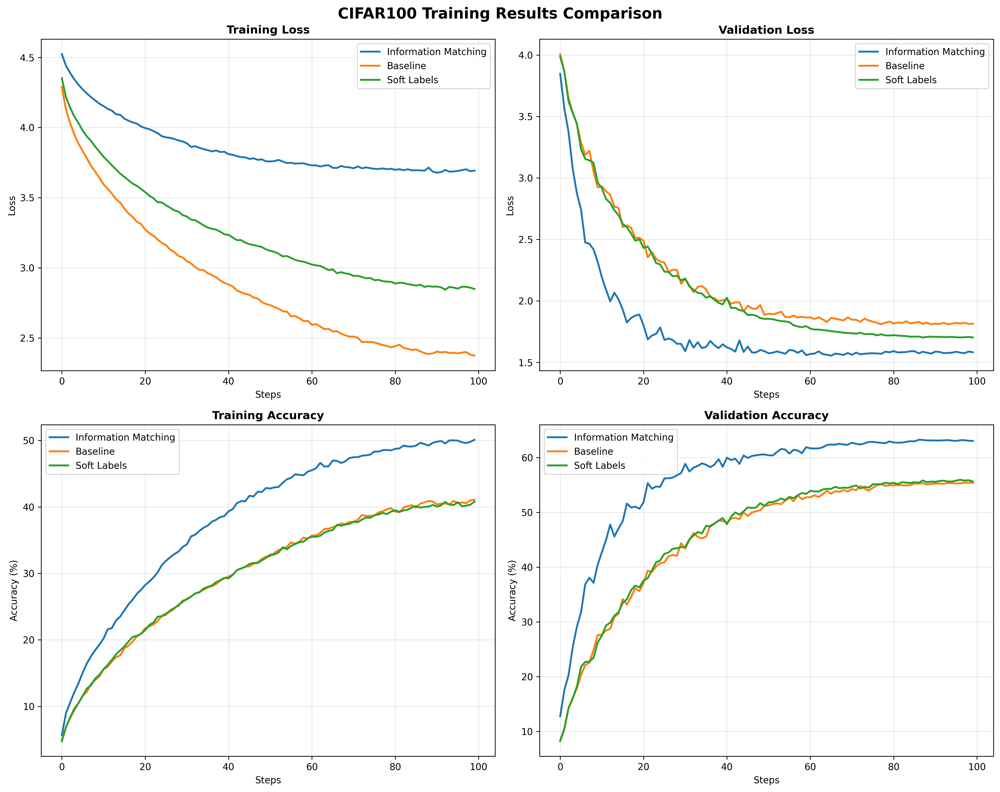
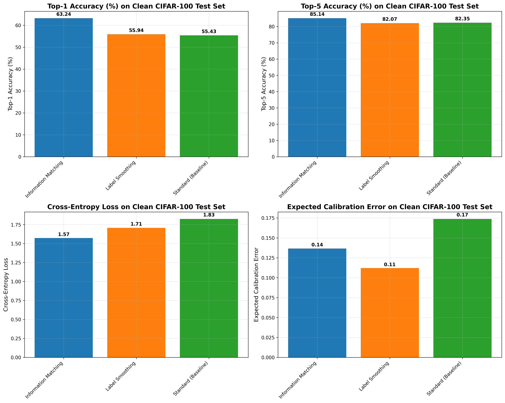
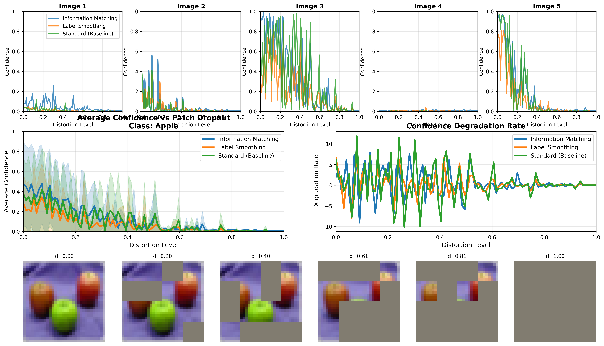
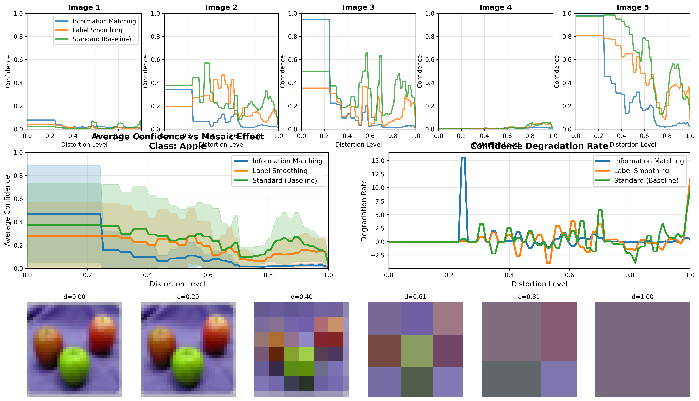
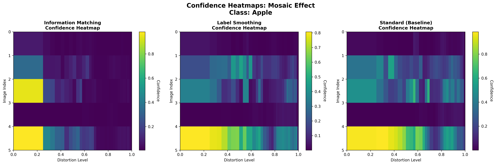
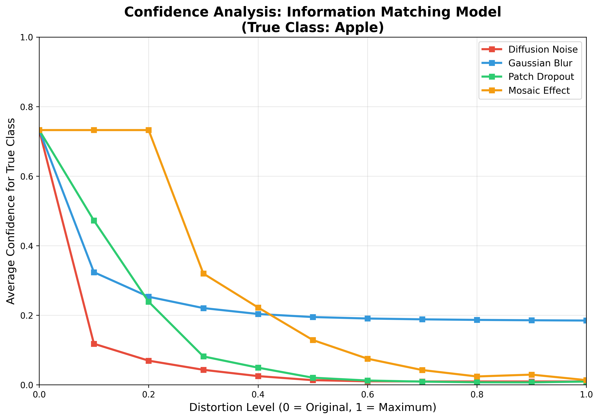

# MI-Adaptive-Label-Smoothing-Entropy-Aware-Augmentation-for-Image-Classification

This repository contains the implementation and evaluation of **Information Matching (IM)**, a novel adaptive label smoothing technique for robust image classification. IM dynamically adjusts class confidence based on the normalized mutual information (NMI) between original and augmented images, making models more robust to degradative augmentations like diffusion noise, blur, dropout, and mosaicking.

The method is evaluated on the CIFAR-100 dataset, comparing IM against standard hard-label training and fixed label smoothing.

## Overview

Data augmentation enhances model robustness but often ignores information loss in degraded samples. IM addresses this by softening labels proportionally to entropy loss, quantified via NMI. This encourages calibrated predictions on noisy inputs, improving accuracy, robustness, and calibration.

## Requirements

- Python 3.8+
- PyTorch 2.0+
- Torchvision
- NumPy
- Matplotlib
- Tqdm

Install dependencies:
```
pip install torch torchvision numpy matplotlib tqdm
```

Download CIFAR-100 automatically via Torchvision.

## Training

Train models on CIFAR-100 using ResNet-18. All scripts use the same augmentations (diffusion, blur, dropout, mosaic) but differ in label handling.

### 1. Standard (Hard Labels)
```
python scripts/train_standard_cifar.py
```
- Uses hard one-hot labels.
- Saves model to `standard_model.pth`.

### 2. Label Smoothing (Fixed ε=0.1)
```
python scripts/train_cifar_soft_labels.py
```
- Applies uniform label smoothing.
- Saves model to `ls_model.pth`.

### 3. Information Matching (IM)
```
python scripts/train_im_cifar.py
```
- Adaptive smoothing via NMI.
- Saves model to `im_model.pth`.

Training runs for up to 100 epochs with AdamW optimizer. Models are saved based on best validation accuracy.

## Evaluation

### General Evaluation
Run evaluation on trained models:
```
python scripts/evaluate_models.py
```
- Computes top-1/5 accuracy, cross-entropy loss, ECE on clean test set.
- Assesses robustness under degradations.
- Generates plots in `plots/` folder.

## Results

Experiments on CIFAR-100 show IM outperforms baselines:

| Model       | Top-1 Acc (%) | Top-5 Acc (%) | ECE    | CE Loss |
|-------------|---------------|---------------|--------|---------|
| IM         | 63.24        | 85.14        | 0.1366 | 1.5724 |
| LS         | 55.94        | 82.07        | 0.1121 | 1.7069 |
| Baseline   | 55.43        | 82.35        | 0.1738 | 1.8251 |

### Plots

- **Training Comparison**:  
  

- **General Metrics Comparison**:  
  

- **Confidence Analysis (Dropout, Apple Class)**:  
  

- **Confidence Analysis (Mosaic, Apple Class)**:  
  

- **Confidence Heatmap (Mosaic, Apple Class)**:  
  

- **Confidence per Distortion (IM Model, Apple Class)**:  
  

## Citation

If you use this work, please cite:
```
@article{bonilla2025mi,
  title={Mutual Information-Guided Adaptive Label Smoothing for Robust Image Classification via Degradative Augmentations},
  author={Bonilla, Diego},
  year={2025},
  note={arXiv preprint (forthcoming)}
}
```

For questions, open an issue or contact the author.
